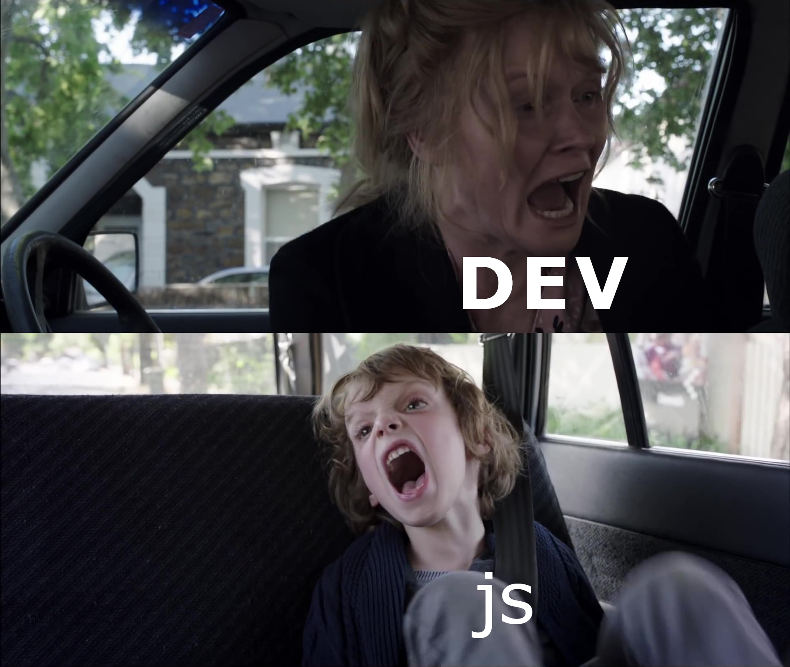

**Run in bash**:

`sh reliability-test.sh <test-file-inside-cypress> <tries>`

### What's with the browserlist warning??
🤷🤷🤷🤷🤷🤷🤷
I have no idea. Ask cypress. Ask the browserlist people.
I only care it remains in the terminal and doesn't reach the report file.

### How does the browserlist warning bypass linux's sed??
Hell if I know...

### Why does the browserlist warning keep happening after 2 separate attempts at supressing it??
Beats me...

### What's with the similar looking javascript file??
We talk to js once this meme is not relevant anymore

